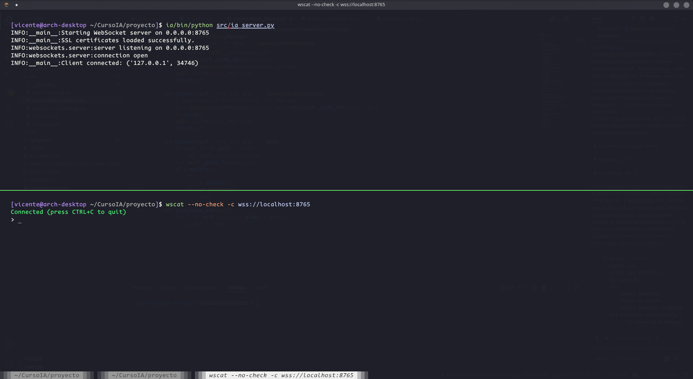
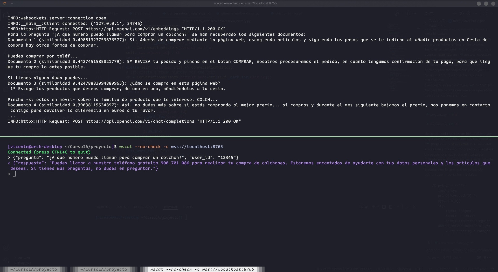

# ColchonesIA
Repositorio para almacenar el proyecto capstone de colchones.es para el curso Desarrollador x10 del IIA

# CAPSTONE: Evolución del Chat de IA - Colchones.es

## Cómo probar el RAG

Lanzar el servidor WS:
```
python src/ia_server.py
```
Probar con un cliente de websockets:
```
wscat --no-check -c wss://localhost:8765
```





## Contexto
En **Colchones.es**, dentro de las fichas de producto, disponemos de un chat de IA donde el usuario puede realizar consultas sobre el artículo que está visitando. Este sistema se desarrolló inicialmente de manera básica: se envía el HTML de la ficha directamente al modelo de lenguaje. Es un servicio que está operativo actualmente, pero resulta limitado y presenta carencias en la calidad y precisión de las respuestas. 

---

## Propuesta
El proyecto consiste en evolucionar este chat hacia un sistema más fiable y útil. La mejora se aborda por tres vías complementarias: 

1. **Estructuración de Datos (Contexto):** Sustituir el envío actual de código HTML en bruto por una ingesta de datos estructurada (formato **JSON**).
2. **Modelo de Recomendación (ML):** Entrenar un modelo de **Machine Learning** con un histórico real de más de **3.000 encuestas** de clientes (incluyendo datos de peso, altura, sexo, valoración y evolución de molestias antes/después). El objetivo es generar recomendaciones personalizadas y objetivas basadas en datos. 
3. **Sistema de Consulta (RAG):** Implementar un sistema **RAG (Retrieval-Augmented Generation)** para responder preguntas genéricas del sitio (plazos de entrega, FAQs, formas de pago, garantías, devoluciones, etc.). 
    * **Objetivo 1:** Dotar al modelo de mucha más información para que pueda abarcar más respuestas y estas sean más certeras.
    * **Objetivo 2:** Reducir el coste de las consultas (evitando inyectar repetitivamente toda esta información estática en el contexto de cada llamada).

---

## Alcance y Consideraciones
Debido a la coincidencia con el periodo navideño, la implementación de estos tres módulos constituye el **Producto Mínimo Viable (MVP)** del proyecto. 

> [!TIP]
> **Ampliación potencial:** Si el tiempo lo permite, se valorará ampliar el alcance con un sistema de enrutado o **agentes** capaces de cubrir más tipos de preguntas y operar con datos estructurados de todo el catálogo, y no solo con la ficha que el usuario esté visualizando en ese momento.
