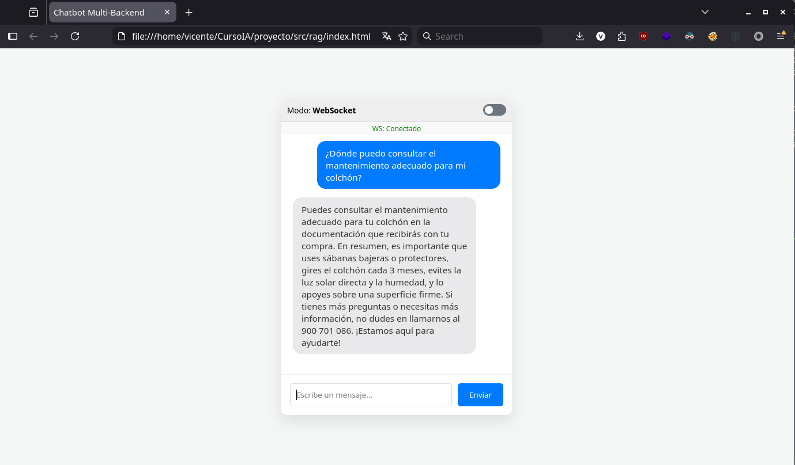
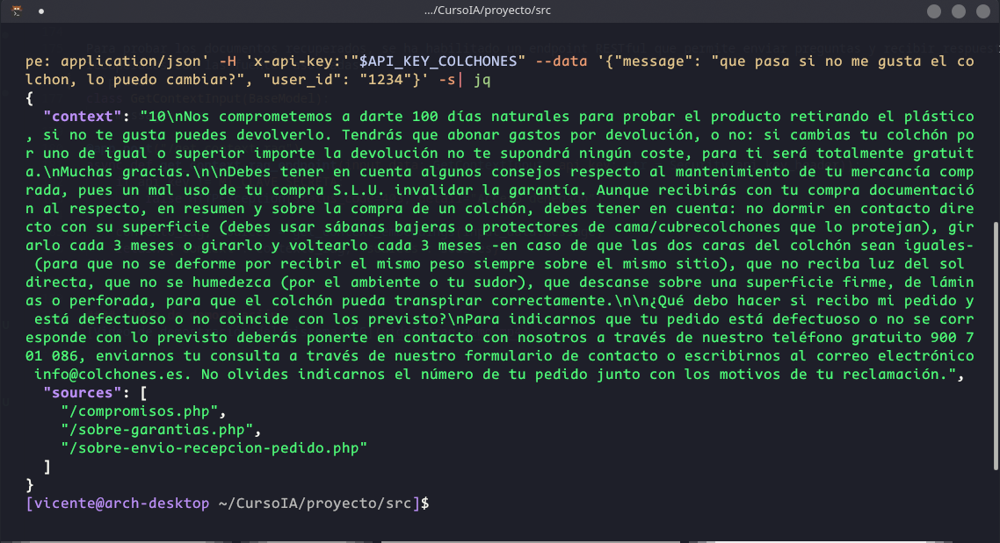

# ColchonesIA
Repositorio para almacenar el proyecto capstone de colchones.es para el curso Desarrollador x10 del IIA

# CAPSTONE: Evolución del Chat de IA - Colchones.es

## Índice
- [Memoria inicial](#memoria-inicial)
    - [Contexto](#contexto)
    - [Propuesta](#propuesta)
    - [Alcance y Consideraciones](#alcance-y-consideraciones)
- [RAG](#rag)
    - [Objetivo](#objetivo)
    - [Implementación](#implementación)
        - [Obtención y tratamiento de datos](#obtención-y-tratamiento-de-datos)
        - [Chunking](#chunking)
        - [Modelo de embeddings](#modelo-de-embeddings)
        - [Base de datos vectorial](#base-de-datos-vectorial)
        - [Recuperación y generación de respuestas](#recuperación-y-generación-de-respuestas)
    - [Despliegue](#despliegue)
    - [Integración con el chat de IA actual](#integración-con-el-chat-de-ia-actual)
    - [Video de demostración](#video-de-demostración)

## Memoria inicial

## Contexto
En **Colchones.es**, dentro de las fichas de producto, disponemos de un chat de IA donde el usuario puede realizar consultas sobre el artículo que está visitando. Este sistema se desarrolló inicialmente de manera básica: se envía el HTML de la ficha directamente al modelo de lenguaje. Es un servicio que está operativo actualmente, pero resulta limitado y presenta carencias en la calidad y precisión de las respuestas. 

---

## Propuesta
El proyecto consiste en evolucionar este chat hacia un sistema más fiable y útil. La mejora se aborda por tres vías complementarias: 

1. **Estructuración de Datos (Contexto):** Sustituir el envío actual de código HTML en bruto por una ingesta de datos estructurada (formato **JSON**).
2. **Modelo de Recomendación (ML):** Entrenar un modelo de **Machine Learning** con un histórico real de más de **3.000 encuestas** de clientes (incluyendo datos de peso, altura, sexo, valoración y evolución de molestias antes/después). El objetivo es generar recomendaciones personalizadas y objetivas basadas en datos. 
3. **Sistema de Consulta (RAG):** Implementar un sistema **RAG (Retrieval-Augmented Generation)** para responder preguntas genéricas del sitio (plazos de entrega, FAQs, formas de pago, garantías, devoluciones, etc.). 
    * **Objetivo 1:** Dotar al modelo de mucha más información para que pueda abarcar más respuestas y estas sean más certeras.
    * **Objetivo 2:** Reducir el coste de las consultas (evitando inyectar repetitivamente toda esta información estática en el contexto de cada llamada).

---

## Alcance y Consideraciones
Debido a la coincidencia con el periodo navideño, la implementación de estos tres módulos constituye el **Producto Mínimo Viable (MVP)** del proyecto. 

> [!TIP]
> **Ampliación potencial:** Si el tiempo lo permite, se valorará ampliar el alcance con un sistema de enrutado o **agentes** capaces de cubrir más tipos de preguntas y operar con datos estructurados de todo el catálogo, y no solo con la ficha que el usuario esté visualizando en ese momento.


## RAG
### Objetivo
Implementar un sistema RAG (Retrieval-Augmented Generation) para mejorar la capacidad del chat de IA en Colchones.es, permitiendo respuestas más precisas y relevantes a las consultas de los usuarios, reduciendo costes y mejorando la experiencia del usuario. La idea es evitar tener que inyectar toda la información estática en cada consulta, reduciendo así el coste asociado a las llamadas al modelo de lenguaje y mejorando la calidad de las respuestas al reducir el ruido en el contexto. Para ello, usaremos como fuente de información un conjunto de páginas web estáticas que contienen información relevante sobre Colchones.es (FAQs, políticas de devolución, formas de pago, plazos de entrega, etc.).

### Implementación
#### Obtención y tratamiento de datos:
Los datos con los cuales se alimentará el sistema RAG se obtienen de un conjunto de páginas web estáticas que contienen información relevante sobre Colchones.es. El sistema es capaz de extraer y procesar esta información para su posterior uso en el sistema RAG. Las páginas están identificadas por su URL. Por defecto se cargan en la base de datos vectorial una serie de páginas predefinidas, pero el sistema permite añadir nuevas páginas web para ampliar la base de conocimiento, para lo cual se habilita un endpoint específico.

La información es redactada por nuestros editores, por lo la información ya se presenta de forma clara y estructurada en párrafos en los que cada cual transmite una idea independiente, por lo que para obtener los chunks hemos optado por emplear CharacterTextSplitter de LangChain, utilizando como separadores los saltos de línea y los puntos, de modo que cada chunk contenga una idea completa. Además, como el texto se almacena en HTML podemos utilizar librerías como BeautifulSoup para preprocesar el texto y extraer únicamente el contenido relevante, consevando únicamente las etiquetas HTML que aportan información. Así, generamos un salto de línea al encontrar elementos de bloque para que la técnica de chunking pueda aprovecharlos como separadores.

Posteriormente, cada fragmento es transformado en un vector de características con el modelo de embeddings de OpenAI. Estos vectores son almacenados en una base de datos vectorial (Chroma) para su posterior recuperación.

#### Chunking
La técnica de chunking empleada es la de "CharacterTextSplitter" de la librería LangChain, utilizando como separadores los saltos de línea, con un tamaño de chunk de 1000 caracteres y un solapamiento de 200 caracteres.

``` python
from langchain.text_splitter import RecursiveCharacterTextSplitter
text_splitter = RecursiveCharacterTextSplitter(chunk_size=1000, chunk_overlap=200, separators=chunksSeparators)

```

Estos parámetros de configuración nos han resultado exitosos en las pruebas realizadas.

Para manejar la información, etiquetamos cada chunk con metadatos que incluyen la URL de origen y un identificador único. Esto facilita la trazabilidad y el manejo de los datos en la base de datos vectorial y nos permite actualizar el contenido en la base de datos si la fuente original cambia.

``` python
metadatas = [{"source": url_pagina} for _ in range(len(texts))]
```

#### Modelo de embeddings
Para transformar los fragmentos de texto en vectores de características, utilizamos el modelo de embeddings de OpenAI, específicamente "[text-embedding-3-small](https://platform.openai.com/docs/models/text-embedding-3-small)". Aunque hemos probado otros modelos como "[text-embedding-3-large](https://platform.openai.com/docs/models/text-embedding-3-large)" o "[text-embedding-ada-002](https://platform.openai.com/docs/models/text-embedding-ada-002)", hemos optado por "text-embedding-3-small" debido a su equilibrio entre rendimiento y coste.

Para inicializar el modelo de embeddings, utilizamos la siguiente función:

```python
def get_embeddings_model():
    os.environ["OPENAI_API_KEY"] = os.getenv("OPENAI_API_KEY")
    embeddings_model = OpenAIEmbeddings(
        model="text-embedding-3-small"
        #model="text-embedding-3-large" 
    )

    return embeddings_model
```

#### Base de datos vectorial
Para almacenar y gestionar los vectores de características, utilizamos Chroma como base de datos vectorial. Hemos planteado la posibilidad de utilizar otras bases de datos vectoriales como VectorStores de OpenAI o PostgreSQL (con la que tenemos experiencia previa) con la extensión pgvector, pero Chroma nos ha resultado suficiente para las necesidades del proyecto y adecuada por su simplicidad y rendimiento.

```python
    vectorstore = Chroma(
        collection_name=configuration.get("collection_name"),
        embedding_function=get_embeddings_model(),
        persist_directory=configuration.get("persist_dir")
    )
```

#### Recuperación y generación de respuestas
Para responder a las consultas de los usuarios, el sistema recupera los fragmentos más relevantes de la base de datos vectorial utilizando similitud de coseno. Estos fragmentos se utilizan como contexto. Para recuperar los fragmentos, utilizamos el siguiente código:

```python
def get_context_embeddings(pregunta: str):
    docs = vectorstore.similarity_search_with_relevance_scores(pregunta, k=3)

    try:
        docs = sorted(docs, key=lambda pair: pair[1], reverse=True)
    except Exception:
        pass

    if configuration["debug"]:
        print(f"Para la pregunta '{pregunta}' se han recuperado los siguientes documentos:")
        for i, (d, similarity) in enumerate(docs):
            print(f"Documento {i+1} (similaridad {similarity}): {d.page_content}...")
    
    context = "\n\n".join(d.page_content for (d, _) in docs).strip()
    sources = [doc.metadata.get("source") for (doc, _) in docs]
    sources = [("/" + s) if not s.startswith("http") else s for s in sources]
    return (context, sources)
```
Utilizamos la función `similarity_search_with_relevance_scores` para recuperar los 3 fragmentos más relevantes en función de la consulta del usuario. Ordenamos los documentos por su puntuación de similitud y los concatenamos para formar el contexto que se proporcionará al modelo de lenguaje. Además, recuperamos las fuentes con las que previamente hemos etiquetado cada chunk para poder mostrarlas en la respuesta y ofrecer al usuario la posibilidad de consultar la fuente original para ampliar información.

### Despliegue
El sistema RAG se puede probar de forma autónoma, pero se ha diseñado con la idea de integrarlo posteriormente en el chat de IA de Colchones.es. El RAG se ubica dentro de una subcarpeta RAG dentro de src, donde se encuentra el código del chatbot principal. Para facilitar las pruebas, se ha implementado un servidor WebSocket (y otro restful) que permite enviar preguntas y recibir respuestas desde el frontend de ejemplo.
Para generar el archivo requirements.txt se ha utilizado pipreqs.

Una vez instaladas las dependencias, se puede lanzar el servidor WebSocket con el siguiente comando:

```bash
python src/rag/src/ia_server.py
```
Desde línea de comandos podemos probar el servidor con un cliente de websockets como wscat:

```bash
wscat --no-check -c wss://localhost:8765
```


Para probar el RAG con la interfaz debemos configurar el navegador para que acepte certificados autofirmados, ya que el servidor utiliza SSL para las comunicaciones.


*Llamada al RAG con el frontend [index.html](src/rag/index.html)*

### Integración con el chat de IA actual
El sistema RAG está diseñado para integrarse con el chat de IA existente en Colchones.es. Para ello, se integra en forma de tool que el modelo de lenguaje puede invocar cuando el cliente no pregunta sobre un producto específico, sino sobre aspectos generales de la tienda (políticas de devolución, formas de pago, plazos de entrega, etc.). El flujo de integración es el siguiente:
1. El usuario realiza una consulta a través del chat de IA.
2. El sistema determina si la consulta es general o específica del producto.
3. Si la consulta es general, se invoca el sistema RAG para recuperar la información relevante y generar una respuesta.
4. La respuesta generada por el sistema RAG se envía al usuario a través del chat de IA.

```python
 if msg_ia.tool_calls:
    tool_call = msg_ia.tool_calls[0]
    name = tool_call.function.name
    args = json.loads(tool_call.function.arguments)

    ...

if name == "buscar_info_general":
    res_tool, _sources = get_context_embeddings(input_data.message)
    if _sources:
        res_tool = f"{res_tool} \n\n(Indica al usuario que puede consultar la siguiente fuente para obtener más información: https://www.colchones.es{_sources[0]})"
            
```
Si la consulta generada tiene una fuente asociada, se incluye en el prompt para que el modelo de lenguaje pueda indicársela al usuario en la respuesta.

Para probar los documentos recuperados, se ha habilitado un endpoint RESTful que permite enviar preguntas y recibir respuestas en formato JSON y ver los documentos recuperados con las fuentes asociadas.
```python
class GetContextInput(BaseModel):
    message: str

@app.post("/get_context_rag")
async def get_context_rag_endpoint(input_data: GetContextInput, api_key: str = Security(api_key_header)):
    if api_key != MI_CLAVE_SECRETA:
        raise HTTPException(status_code=403, detail="Acceso denegado")

    contexto_rag, sources = get_context_embeddings(input_data.message)
    return {"context": contexto_rag, "sources": sources}
```



#### Video de demostración
[Video de demostración del sistema RAG](videos/rag_demo.mp4)
